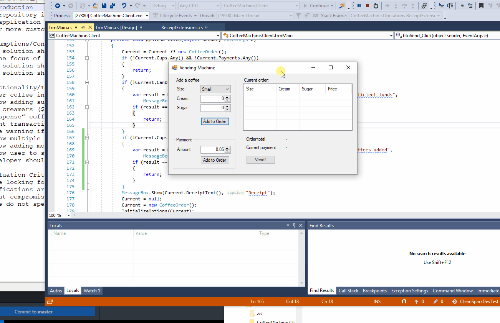

# Sample Interaction

# Project Structure
 - [Model Definitions](CoffeeMachine/CoffeeMachine.Model/): Consists of the plain class models for the system.
 - [Data Access](CoffeeMachine/CoffeeMachine.DataAccess/): Retrieves static constant data as a Mock currently, but is intended to be from a persistent data source eventually
 - [Operations](CoffeeMachine/CoffeeMachine.Operations/): Logic involving how extras and coffee types work
 - [Tests](CoffeeMachine/CoffeeMachine.Tests/): Current suite of tests uses [xUnit](https://xunit.github.io/)
 
Constraints below made me ignore pennies as a unit to accept or dispense so that is why inputs start a 0.05 and round when entered as well as dispense rounded up values.  Extension methods are used to keep models and code small, concise, and malleable for functional pipelines.

# Introduction 
This repository is the starting point for the CleanSpark back-end developer exercise. The full solution will be a .NET application that mimics the functionality of a coffee vending machine. It will provide the means of ordering one or more customizable cups of coffee, providing payment, receiving change, and dispensing the correct product. 

# Assumptions/Constraints
- The solution should use the existing WinForms front end as the user interface. The interface can be changed but is not the focus of this exercise.
- The solution should not depend on any external web services.
- The solution should not require a persistent data store.

# Functionality/Tasks Performed
- Order coffee in 3 sizes (small for $1.75, medium for $2.00, large for $2.25).
- Allow adding sugar and cream in discrete increments to each coffee order (from 1 – 3 sugars ($0.25 each) and from 1 – 3 creamers ($0.50 each)).
- “Dispense” coffee when an order is completed if adequate payment has been provided, and display money remaining in payment transaction.
- Give warning if adequate payment has not been provided.
- Allow multiple coffee orders per payment transaction.
- Allow adding money in standard monetary increments (from $0.05 to $20).
- Allow user to specify the end of a payment transaction and dispense change.
- Developer should provide a minimum set of passing unit tests
 
# Evaluation Criteria
We are looking for concise and readable code that meets the component specifications. Where the component specifications are ambiguous or lacking, we are looking for you to make a decision that allows you to move forward without compromising the basic functionality of the application. We are expecting this task to take you 1-3 hours; please do not spend more than 5 hours on this task.
